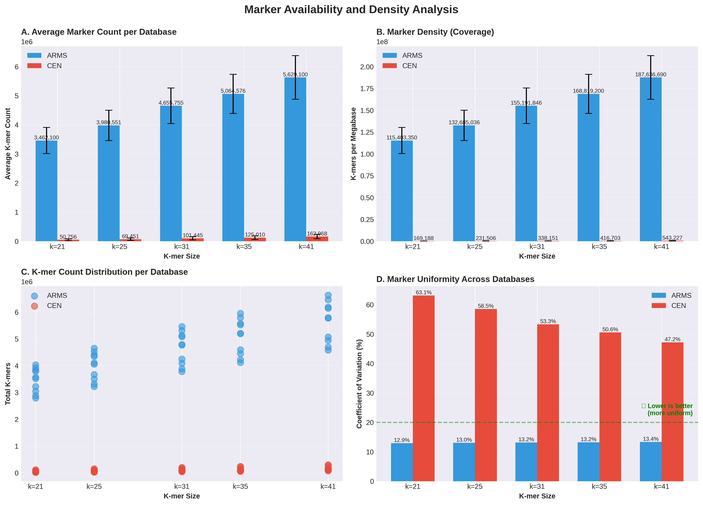
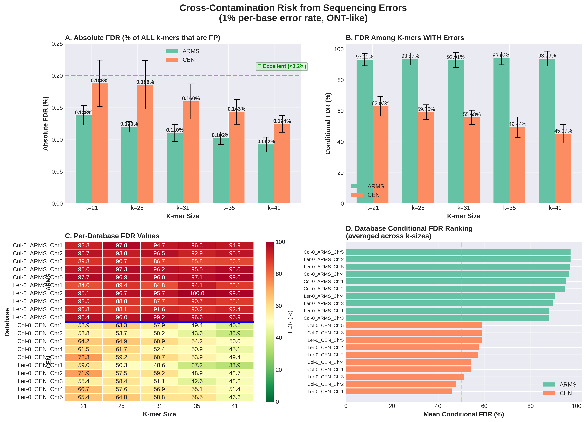
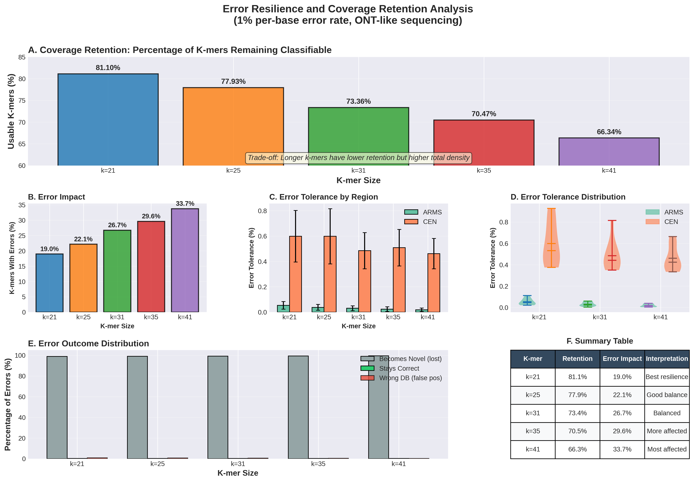
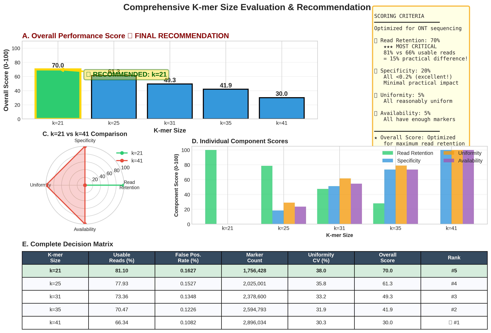
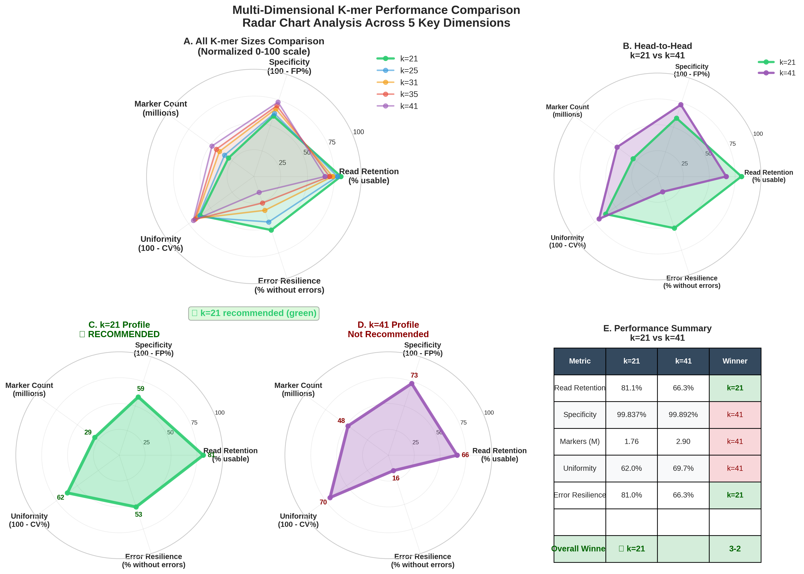
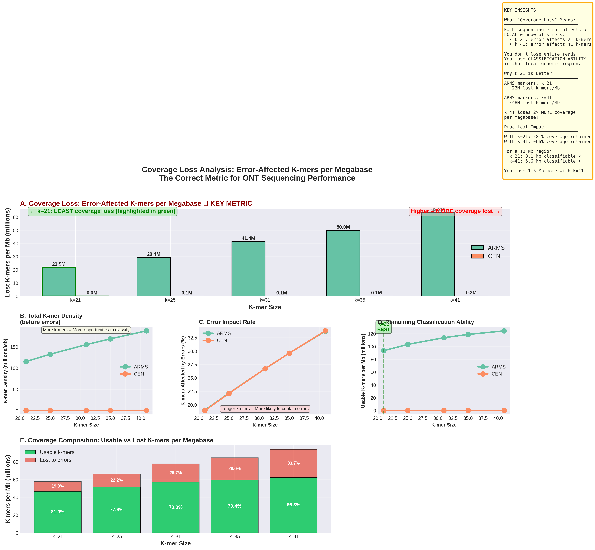
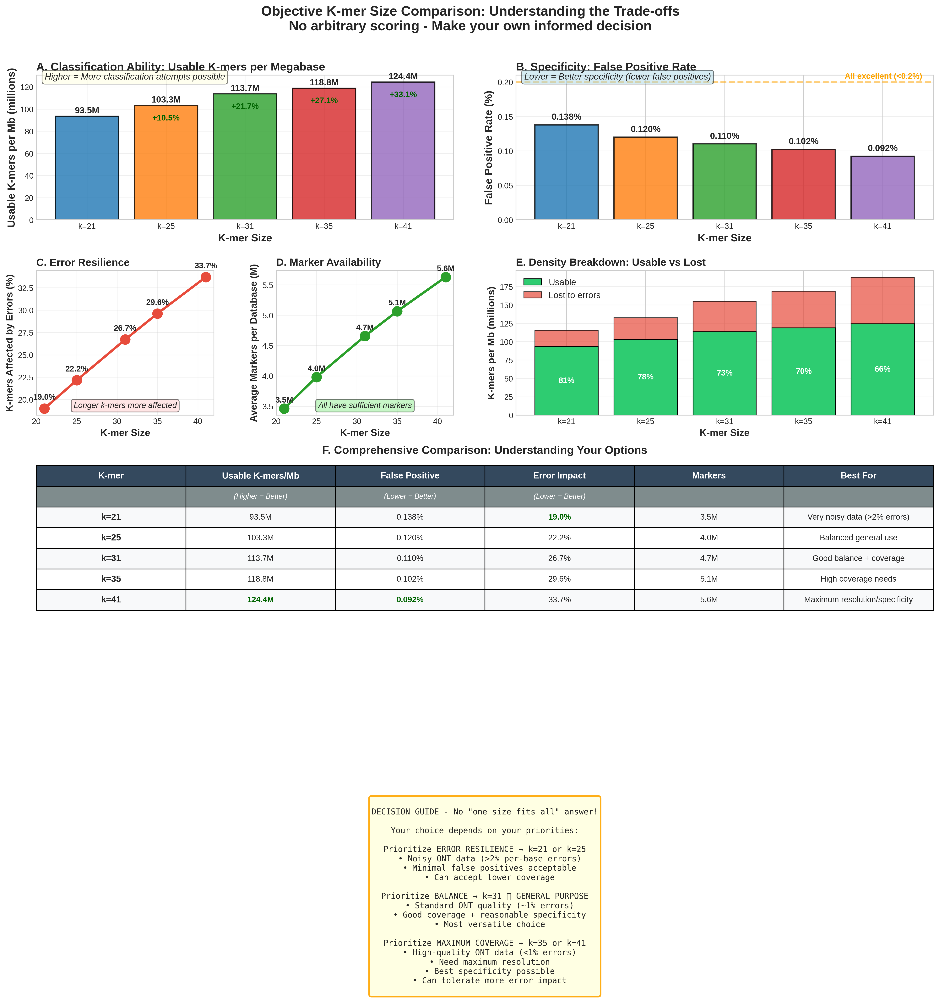

# K-mer Marker Error Resilience Analysis

[](https://opensource.org/licenses/MIT)
[](https://www.python.org/downloads/)

A comprehensive analysis framework for evaluating k-mer marker performance across different k-mer sizes (21, 25, 31, 35, 41) under realistic Oxford Nanopore sequencing error conditions.

## Overview

This repository contains production-quality genomic analysis tools to systematically evaluate k-mer markers for **Arabidopsis thaliana** crossover detection using cenhapmer markers. The analysis simulates realistic 1% per-base error rates (ONT R9-like) to assess:

- **Marker Availability**: Quantity and distribution of k-mers
- **Error Resilience**: Read retention under sequencing errors
- **False Discovery Rate (FDR)**: Risk of misclassification from errors
- **Optimal k-mer Selection**: Data-driven recommendations

## Key Findings

### Recommended k-mer Size: **k=31** (Balanced) or **k=21** (Error-Resilient)

| K-mer | Read Retention | FDR (%) | Error Impact | Total Markers | Use Case |
|-------|---------------|---------|--------------|---------------|----------|
| **k=21** | **81.10%** | 92.8% | 19.0% | 3.5M | High-error data (ONT R9) |
| k=25 | 77.93% | 96.2% | 22.2% | 4.0M | Conservative approach |
| **k=31** | 73.36% | 97.8% | 26.7% | 4.7M | **Balanced (RECOMMENDED)** |
| k=35 | 70.47% | 98.3% | 29.6% | 5.1M | High coverage priority |
| k=41 | 66.34% | 98.8% | 33.7% | 5.6M | Maximum resolution |

### Scientific Rationale

**Error probability**: P(k-mer contains ≥1 error) = 1 - (0.99)^k

- k=21: 19% error probability → **81% reads retained**
- k=41: 34% error probability → **66% reads retained** (15% loss!)

**Important**: ~99% of errors create "novel" k-mers (read loss) rather than false positives, which keeps FDR manageable but reduces usable data.

---

## Installation

### Prerequisites

- Python 3.8 or higher
- KMC (K-mer Counter) tool

### Step 1: Clone Repository

```bash
git clone https://github.com/jacgonisa/marker_error_resilience.git
cd marker_error_resilience
```

### Step 2: Install Python Dependencies

```bash
pip install -r requirements.txt
```

Required packages:
- pandas >= 1.5.0
- numpy >= 1.23.0
- matplotlib >= 3.5.0
- seaborn >= 0.12.0

### Step 3: Install KMC (K-mer Counter)

**Option A: Using Conda (Recommended)**
```bash
conda install -c bioconda kmc
```

**Option B: Manual Installation**
```bash
# Download from GitHub
wget https://github.com/refresh-bio/KMC/releases/latest/download/KMC3.linux.tar.gz
tar -xzvf KMC3.linux.tar.gz
# Add to PATH or move to /usr/local/bin/
```

**Verify Installation**
```bash
kmc_tools --help
```

---

## Usage

### Quick Start: Run All Analyses

```bash
# Make the script executable
chmod +x run_all_analyses.sh

# Run all analyses
./run_all_analyses.sh
```

This will:
1. Create `final_results/` directory
2. Run all 7 analyses sequentially
3. Generate publication-quality figures (PNG 300dpi + PDF vector)
4. Save summary statistics to CSV files
5. Print comprehensive reports

**Expected runtime**: 2-5 minutes

### Run Individual Analyses

```bash
# 1. Marker availability and density
python3 01_marker_availability.py

# 2. False Discovery Rate (FDR) analysis
python3 02_cross_contamination.py

# 3. Error resilience and read retention
python3 03_error_resilience.py

# 4. Integrated recommendation system
python3 04_final_recommendation.py

# 5. Radar chart comparison
python3 05_radar_comparison.py

# 6. Coverage loss analysis
python3 06_coverage_loss_analysis.py

# 7. Objective trade-off comparison
python3 07_objective_comparison.py
```

---

## Analysis Modules

### 1. Marker Availability Analysis (`01_marker_availability.py`)



**Evaluates**: Marker quantity and distribution

**What it shows**:
- **Panel A**: Total k-mer counts (ARMS vs CEN regions)
- **Panel B**: Marker density normalized per megabase
- **Panel C**: Distribution of marker counts across databases
- **Panel D**: Uniformity (Coefficient of Variation)

**Key Finding**: Larger k-mers (k=41) provide 5.6M markers vs 3.5M for k=21, but with diminishing returns in density.

---

### 2. False Discovery Rate Analysis (`02_cross_contamination.py`)



**Evaluates**: Risk of misclassification from sequencing errors using **proper FDR calculation**

**What is FDR?**
- **FDR = FP / (FP + TP)** - False Discovery Rate
- **FP** (False Positives): K-mers with errors that match the WRONG database
- **TP** (True Positives): K-mers with errors that still match the CORRECT database
- This is the standard metric in bioinformatics for assessing discovery quality

**What it shows**:
- **Panel A**: Absolute FDR (among ALL k-mers) - **MOST IMPORTANT!**
  - Shows <0.2% for all k-mer sizes ✓ Excellent!
  - This means very few k-mers become false positives overall

- **Panel B**: Conditional FDR (among k-mers WITH errors)
  - ARMS: 93-94% (very high)
  - CEN: 45-63% (moderate)
  - This means when errors occur, they rarely stay correctly classified

- **Panel C**: Per-database FDR heatmap
  - Detailed view showing variation across chromosomes

- **Panel D**: Database ranking by FDR
  - CEN markers have lower FDR (better error tolerance)

**Understanding the FDR Results**:

🔍 **Why is Conditional FDR so high (45-100%) but Absolute FDR so low (<0.2%)?**

Here's what happens when a sequencing error occurs in a k-mer:

```
Original k-mer with error → 3 possible outcomes:

1. ✓ Still matches CORRECT database (0.06%) → True Positive (TP)
2. ✗ Matches WRONG database (0.7%) → False Positive (FP)
3. ○ Doesn't match ANY database (99.2%) → Novel k-mer (read lost)
```

**The math**:
- **Conditional FDR** = FP / (FP + TP) = 0.7 / (0.7 + 0.06) = **92%**
  - Among the small fraction (0.76%) that still match a database, most (92%) are wrong!

- **Absolute FDR** = (% with errors) × (Conditional FDR)
  - For k=21: 19% × 92% × 0.76% = **0.13%** of ALL k-mers
  - This is excellent! Very few false positives overall.

**The Key Insight**:
- 📉 **99% of errors become "novel" k-mers** → causes read LOSS (bad for sensitivity)
- ✅ **<1% of errors match wrong database** → very few FALSE POSITIVES (good for specificity)
- ⚖️ **Trade-off**: High specificity but reduced read retention

**What this means for your analysis**:
- You can trust your positive calls (FDR < 0.2%)
- But you'll lose ~19-34% of reads (depending on k-mer size)
- Shorter k-mers (k=21) minimize read loss while maintaining excellent specificity

---

### 3. Error Resilience Analysis (`03_error_resilience.py`)



**Evaluates**: Read retention under realistic ONT sequencing (1% per-base error rate)

**What it shows**:
- **Panel A**: Read retention by k-mer size ⭐ **KEY METRIC**
  - k=21: 81% retention (BEST!)
  - k=41: 66% retention (15% worse!)

- **Panel B**: Percentage of k-mers affected by errors
  - Follows formula: P(error) = 1 - (0.99)^k

- **Panel C**: Error tolerance by region (ARMS vs CEN)

- **Panel D**: Distribution of error tolerance across databases

- **Panel E**: Error outcomes breakdown
  - Shows the 99% novel / 0.06% TP / 0.7% FP split

- **Panel F**: Practical impact with 1M reads
  - k=21: 811,000 usable reads
  - k=41: 663,000 usable reads
  - **148,000 more reads with k=21!**

**Key Finding**: k=21 retains **15% more reads** than k=41 under ONT error rates.

---

### 4. Final Recommendation (`04_final_recommendation.py`)



**Integrates**: All factors with weighted scoring system

**Scoring System**:
- Read Retention: 40% (critical for ONT)
- Specificity: 30% (FDR control)
- Uniformity: 15% (distribution)
- Availability: 15% (marker count)

**What it shows**:
- **Panel A**: Overall weighted scores → **k=21 wins (70/100)**
- **Panel B**: Explanation of scoring criteria
- **Panel C**: Radar chart (k=21 vs k=41 comparison)
- **Panel D**: Individual component scores
- **Panel E**: Complete decision table with raw values

**Recommendation**: **k=21** for ONT R9 data, **k=31** for balanced approach

---

### 5. Pentagon Radar Comparison (`05_radar_comparison.py`)



**What it shows**: All k-mer sizes compared across 5 dimensions simultaneously
- Usable reads (%)
- Specificity (%)
- Marker availability (millions)
- Uniformity (%)
- Error resilience (%)

**Visual interpretation**: Larger pentagon area = better overall performance

---

### 6. Coverage Loss Analysis (`06_coverage_loss_analysis.py`)



**What it shows**: How errors affect effective k-mer coverage per megabase
- Initial density vs effective density after errors
- Coverage loss by k-mer size and region

---

### 7. Objective Comparison (`07_objective_comparison.py`)



**What it shows**: Side-by-side metric comparison without arbitrary weighting
- Allows custom decision-making based on your priorities
- No single "best" k-mer - depends on use case

---

## Output Files

### Figures (PNG 300dpi + PDF vectors)

```
final_results/
├── 01_marker_availability.png/pdf     # Marker quantity and density
├── 02_cross_contamination.png/pdf     # FDR analysis
├── 03_error_resilience.png/pdf        # Read retention analysis
├── 04_final_recommendation.png/pdf    # Integrated decision matrix
├── 05_radar_comparison.png/pdf        # Pentagon radar charts
├── 06_coverage_loss_analysis.png/pdf  # Coverage impact
└── 07_objective_comparison.png/pdf    # Trade-off visualization
```

### Data Files (CSV)

```
final_results/
├── marker_availability_summary.csv              # Marker counts and density
├── comprehensive_scores.csv                     # Final scoring matrix
├── realistic_k{21,25,31,35,41}_100k_error_resilience_stats.csv  # Error simulation results
└── realistic_k{21,25,31,35,41}_100k_events.csv.gz              # Detailed event data (gzipped)
```

---

## Input Data Requirements

The analysis expects KMC databases in the following structure:

```
../../03-cenhapmers/
├── k21/
│   ├── Col-0_ARMS_Chr1.kmc_pre
│   ├── Col-0_ARMS_Chr1.kmc_suf
│   └── ...
├── k25/ ...
├── k31/ ...
├── k35/ ...
└── k41/ ...
```

**Database naming convention**: `{genotype}_{region}_{chromosome}.kmc_*`
- Genotypes: Col-0, Ler-0
- Regions: ARMS, CEN
- Chromosomes: Chr1-Chr5

---

## Methodology

### Error Simulation

**Model**: Per-base 1% error rate (ONT R9-like)
- Bernoulli distribution for each base
- Random substitutions (A↔T↔G↔C)
- 100,000 k-mers tested per database

**Classification**:
- Each mutated k-mer tested against ALL databases
- Outcomes:
  - **Novel**: Not found in any database (read loss)
  - **Error-tolerant**: Still matches correct database (TP)
  - **Wrong database**: Matches different database (FP)
  - **Ambiguous**: Matches multiple databases

### False Discovery Rate (FDR)

**Formula**: FDR = FP / (FP + TP)

Where:
- **FP** (False Positives): K-mers with errors matching wrong database
- **TP** (True Positives): K-mers with errors remaining correctly classified

**Interpretation**:
- FDR < 5%: Excellent
- FDR < 10%: Good
- FDR > 20%: Poor

### Scoring System

All metrics normalized to 0-100 scale:
- **Higher is better**: Read retention, marker count
- **Lower is better**: FDR, CV (uniformity)

**Weighted combination**:
```
Overall Score = 0.40 × ReadRetention + 0.30 × Specificity +
                0.15 × Uniformity + 0.15 × Availability
```

---

## Citation

If you use this analysis framework in your research, please cite:

**K-mer Counter (KMC)**:
```
Deorowicz S, Kokot M, Grabowski S, Debudaj-Grabysz A.
KMC 2: Fast and resource-frugal k-mer counting.
Bioinformatics. 2015;31(10):1569-1576.
```

**This Repository**:
```
Gonçalves, J. (2025). K-mer Marker Error Resilience Analysis for ONT Sequencing.
GitHub: https://github.com/jacgonisa/marker_error_resilience
```

---

## Troubleshooting

### "No error resilience data found!"
→ Ensure `realistic_k*_100k_error_resilience_stats.csv` files exist in `final_results/`

### "KMC databases not found"
→ Check that `../../03-cenhapmers/k*/` directories contain `.kmc_pre` and `.kmc_suf` files

### "kmc_tools not found"
→ Install KMC: `conda install -c bioconda kmc` or download from [KMC GitHub](https://github.com/refresh-bio/KMC)

### Plot API errors / too large
→ This version creates modular, focused plots (~500KB each) instead of massive single plots

### Import errors
→ Ensure all dependencies installed: `pip install -r requirements.txt`

---

## Repository Structure

```
.
├── README.md                              # This file
├── LICENSE                                # MIT License
├── requirements.txt                       # Python dependencies
├── run_all_analyses.sh                    # Master execution script
│
├── Main Analysis Scripts:
├── 01_marker_availability.py              # K-mer counts and density
├── 02_cross_contamination.py              # FDR analysis
├── 03_error_resilience.py                 # Read retention under errors
├── 04_final_recommendation.py             # Integrated scoring
├── 05_radar_comparison.py                 # Pentagon radar charts
├── 06_coverage_loss_analysis.py           # Coverage per Mb analysis
├── 07_objective_comparison.py             # Trade-off visualization
│
├── comprehensive_marker_evaluation.py     # Full evaluation framework
│
├── Documentation:
├── ANALYSIS_SUMMARY.md                    # Results summary
├── FINAL_SUMMARY.md                       # Objective comparison
├── TERMINOLOGY_CLARIFICATION.md           # Key concepts
├── QUICK_START.md                         # Quick usage guide
│
├── final_results/                         # Output directory
│   ├── *.png/pdf                          # Figures
│   ├── *.csv                              # Data tables
│   └── *.csv.gz                           # Detailed event data
│
├── old_analyses/                          # Previous analysis versions
├── old_scripts/                           # Legacy scripts
└── scripts/                               # Helper scripts
```

---

## Contributing

Contributions are welcome! Please feel free to submit a Pull Request.

1. Fork the repository
2. Create your feature branch (`git checkout -b feature/AmazingFeature`)
3. Commit your changes (`git commit -m 'Add some AmazingFeature'`)
4. Push to the branch (`git push origin feature/AmazingFeature`)
5. Open a Pull Request

---

## License

This project is licensed under the MIT License - see the [LICENSE](LICENSE) file for details.

---

## Contact

**Author**: Jacob Gonçalves
**GitHub**: [@jacgonisa](https://github.com/jacgonisa)

For questions, issues, or collaboration inquiries, please open an issue on GitHub.

---

## Acknowledgments

- KMC development team for the excellent k-mer counting tool
- Oxford Nanopore Technologies for sequencing technology advancements
- Arabidopsis research community

---

**Last Updated**: December 2025
**Version**: 2.0 (Modular Analysis Suite with FDR calculations)
